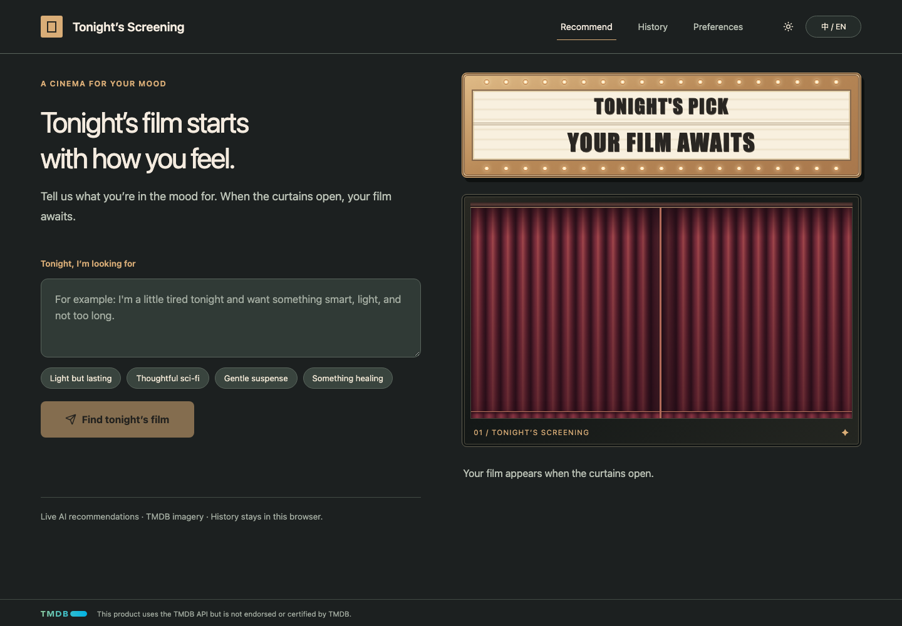
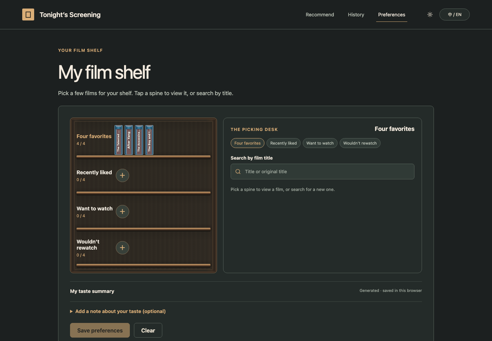
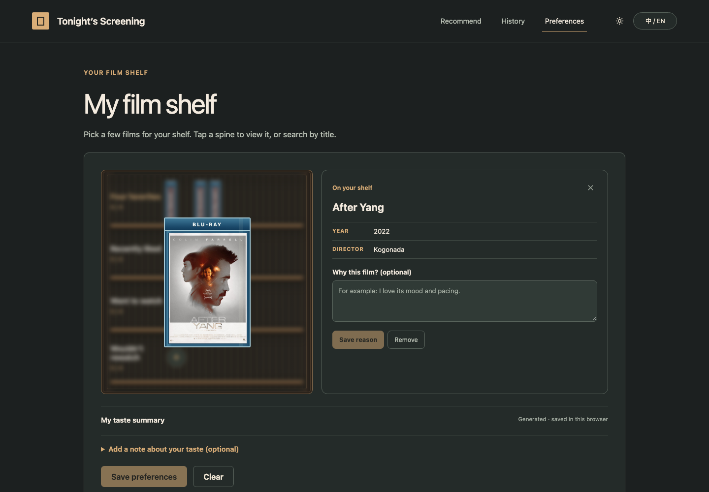

# Movie Rec · Tonight's Screening

A bilingual movie recommendation experience built around the atmosphere of a late-night independent cinema. Describe tonight's mood, open the curtains, and receive live AI recommendations with verified TMDB artwork.

**[Open the live site](https://miss1994forever.github.io/movie-agent/)**



## Features

- Live AI film recommendations based on mood and saved taste
- Chinese and English interface, film titles, and recommendation reasons
- TMDB-verified films with English poster artwork and landscape backdrops
- A personal film shelf for four favorites, recently liked films, watchlist picks, and films the viewer would not rewatch
- Optional reasons for each shelf selection
- An editable taste summary generated from the shelf and written preferences
- Local Letterboxd ZIP import for ratings, watched films, and watchlist context
- Curtain transitions, a physical cinema marquee, and animated 3D Blu-ray cases
- Recommendation history and watched status stored in the browser

## Film shelf

The preference page treats movie selection like browsing a small Blu-ray shop. Long spine titles use graduated font sizes and an ellipsis; opening a case brings it forward while only the shelf is blurred.





## How recommendations work

The Vue frontend sends the current mood, selected films, optional selection reasons, written preferences, the saved taste summary, and a limited list of watched titles to the recommendation service. The service asks the configured language model for candidates, verifies them against TMDB, and returns up to two films with Chinese and English reasons and titles.

The public service currently limits each visitor to three recommendation requests per UTC day, with a shared daily capacity of sixty requests.

## Privacy and storage

The following information stays in the current browser:

- language and theme preferences
- film shelf selections and reasons
- editable taste summary and written preferences
- imported Letterboxd summary and watched titles
- recommendation history and manually marked watched films

The Letterboxd ZIP is parsed locally and is never uploaded. When a recommendation is requested, only the saved preference context and tonight's mood are sent to the recommendation service. AI and TMDB credentials remain on the server. The public service does not keep recommendation results or preference profiles; it stores only salted visitor hashes and daily counters for rate limiting.

The legacy Letterboxd integration in this repository is retained for private local research. It uses unofficial browser automation and must not be exposed as a public service.

## Repository structure

```text
movie-agent/
├── web/frontend/          # Current Vue 3 / Vite public interface
├── web/backend/           # Original local FastAPI application
├── src/movie_rec/         # crewAI recommendation pipeline and CLI
├── Letterboxd-MCP/        # Legacy local Letterboxd MCP server
├── tests/                 # Python tests
├── docs/                  # Setup, security, architecture, and screenshots
├── config/                # Local configuration templates
└── run.py                 # Original local launcher
```

## Frontend development

Requirements: Node.js 20 or later.

```sh
cd web/frontend
npm ci
npm run build
npm run test:import
```

Set the deployed recommendation-service origin in `web/frontend/.env.production` or `.env.local`:

```dotenv
VITE_LIVE_API_URL=https://your-service.example.com
```

Without `VITE_LIVE_API_URL`, the project uses its small in-browser demonstration catalog.

## Legacy local application

The original Python and FastAPI application remains available for local experimentation:

```sh
cp config/.env.example .env
pip install -r web/backend/requirements.txt -r requirements.txt
uvicorn web.backend.app.main:app --host 127.0.0.1 --port 8000
```

Configuration and security details are documented in [`docs/`](docs/). Keep model keys, TMDB credentials, Letterboxd cookies, and passwords out of the browser bundle and Git history.

## Deployment

The static frontend is built with Vite and published from the `gh-pages` branch. Relative asset paths allow it to run under `/movie-agent/`. The public recommendation and TMDB proxy endpoints are deployed separately so no provider credentials are included in the browser bundle.

## Attribution and license

This product uses the TMDB API but is not endorsed or certified by TMDB. It is an unofficial project and is not affiliated with or endorsed by Letterboxd. Letterboxd names and marks belong to their respective owner.

Original project code is available under the [MIT License](LICENSE). Third-party names, data, and assets are covered separately in [THIRD_PARTY_NOTICES.md](THIRD_PARTY_NOTICES.md).
